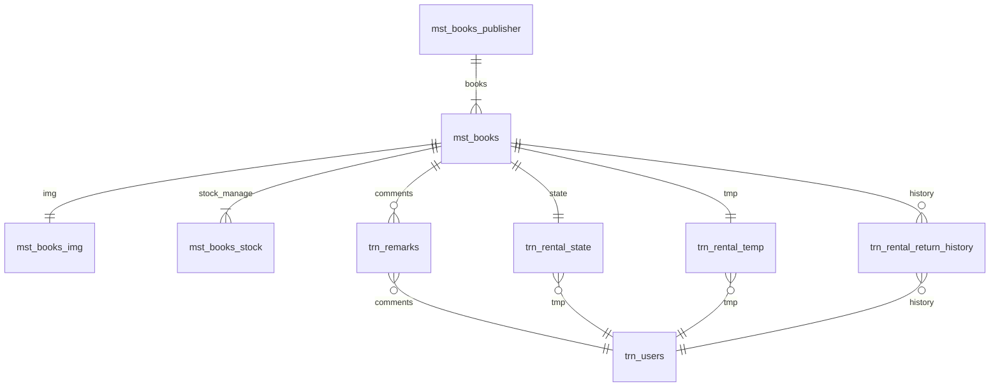

# library-alh
#### App Profile
<!-- Badges -->
<table>
  <tr>
    <td>License</td>
    <td>Env</td>
    <td>Lang</td>
    <td>DB</td>
    <td>Editor</td>
  </tr>
  <tr>
    <td>
      
    </td>
    <td>
      
    </td>
    <td>
      
      
      
    </td>
    <td>
      
    </td>
    <td>
      
    </td>
  </tr>
</table>

#### Author Profile
<table>
  <tr>
    <!-- Start -->
    <td>
      
    </td>
    <!-- Lang -->
    <td>
      
    </td>
    <!-- Follow -->
    <td>
      

        <!-- Twitter -->
        

          
        

        <!-- Github -->
        

          
        

        <!-- Qiita -->
        

          
        

      

    </td>
  </tr>
</table>

---
<!-- Description -->
This repository is `BackEnd API` book library manage app for my own study.

---

# ER
[live editor](https://mermaid-js.github.io/mermaid-live-editor/edit#pako:eNpVjstqw0AMRX9FaNVC_ANeFBq7zSbQQrPzZCFsOTMk80CWCcH2v3ccb1qtxD3nCk3Yxo6xxP4W760lUTjVJkCe96ay4gb1NJyhKN7mAyv4GPgxw_7lEGGwMSUXLq-bv18lqKbjqjGodeG6bKh69r8Cz1A3R0oa0_kvOd3jDB-N-7b5_H9ihXPrs-mp7KloSaAieSq4Q8_iyXX5_WlNDKplzwbLvHYkV4MmLNmjUePPI7RYqoy8wzF1pFw7ugj5LVx-AfLqVWg)

# API IF
|status|method|endpoint|feature|auth|remarks|
|--|--|--|--|--|--|
|<ul><li>[x] </ul>|`POST`|`/sign/up`|sign up|no auth||
|<ul><li>[x] </ul>|`POST`|`/sign/in`|sign in|no auth||
|<ul><li>[ ] </ul>|`POST`|`/user/profile`|get profile.|auth required||
|<ul><li>[x] </ul>|`POST`|`/book/addpublisher`|add publishers.|auth required||
|<ul><li>[ ] </ul>|`POST`|`/book/getpublishers`|get publishers.|auth required||
|<ul><li>[ ] </ul>|`POST`|`/book/getocr`|get ocr about book.|auth required||
|<ul><li>[ ] </ul>|`POST`|`/book/donation`|donate books.|auth required||
|<ul><li>[ ] </ul>|`POST`|`/book/search`|search books|no auth||
|<ul><li>[ ] </ul>|`POST`|`/book/detail`|show a book|no auth||
|<ul><li>[ ] </ul>|`POST`|`/action/commnet`|set comment, star|auth required|on detail view|
|<ul><li>[ ] </ul>|`POST`|`/action/fav`|set favorit|auth required|on list view, detail view|
|<ul><li>[ ] </ul>|`POST`|`/action/rental`|rental a book.|auth required|on detail view|
|<ul><li>[ ] </ul>|`POST`|`/action/return`|return a book.|auth required|on renting view, detail view|
